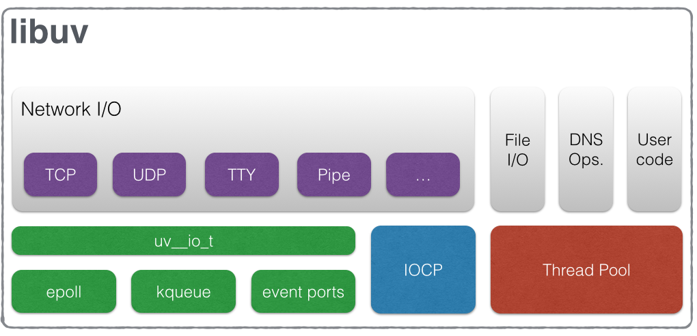
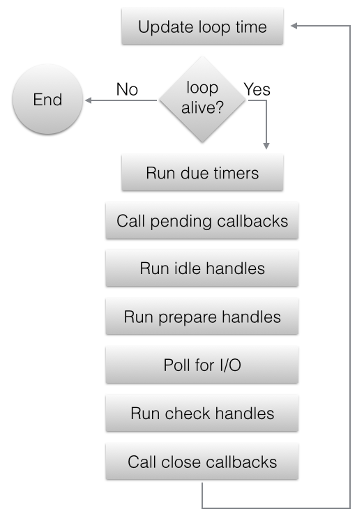

# Мультиплексирование

Содержание:
<!-- TOC -->
* [Мультиплексирование](#)
  * [select](#select)
  * [poll](#poll)
  * [libuv](#libuv)
    * [Event Loop](#event-loop)
    * [libuv Internals](#libuv-internals)
    * [More about libuv](#more-about-libuv)
<!-- TOC -->

## select

**select** - это *level-triggered* мультиплексор.

Ключевой модуль данного мультиплексора - это структура **fd_set**. Мы загружаем в fd_set все наши сокеты и вызываем функцию **select()**, передавая в качестве параметра наше множество сокетов (структуру fd_set). На этом моменте программа блокируется, ожидая ответа от ядра. После возвращения контроля мы проходимся по всем нашим сокетам и определяем, содержится ли этот сокет в возвращенном множестве, то есть готов ли данный сокет принимать/отравлять данные.

**Объявление структуры *fd_set*:**

```c
#ifndef FD_SETSIZE
#define FD_SETSIZE  1024
#endif
#define NBBY    8       /* number of bits in a byte */
typedef long    fd_mask;
#define NFDBITS (sizeof (fd_mask) * NBBY)   /* bits per mask */
#define howmany(x,y)    (((x)+((y)-1))/(y))
typedef struct _types_fd_set {
    fd_mask fds_bits[howmany(FD_SETSIZE, NFDBITS)];
} _types_fd_set;

#define fd_set _types_fd_set
```

Здесь:
- `FD_SETSIZE 1024` - это максимальное количество дескрипторов
- `NBBY` - это количество битов в 1 байте. Это знание требуется закреплять, так как байт не обязательно должен состоять из 8 битов
- `fd_mask` - это тип маски (bit array) для представления файловых дескрипторов, которая выражается в виде `long`
- `NFDBITS` - это количество бит в 1 маске, что равно `sizeof (long)` байт помноженное на количество бит в 1 байте (NBBY)
- `fd_mask fds_bits[howmany(FD_SETSIZE, NFDBITS)]` - это массив из масок, который и служит для регистрирования дескрипторов
- `howmany(x,y)` - это функция, которая считает размер массива масок, требуемый для представления `FD_SETSIZE` дескрипторов. Например, если FD_SETSIZE=1024, а NFDBITS равен 64 (sizeof(long) = 8 байт), то функция вернет 16. То есть мы сохраним массив из 16 масок, которые позволят нам представить всего 1024 дескриптора, ведь полный размер массива - 1024 бит

Для того, чтобы понять работу с битмаской лучше, рассмотрим на примере. Допустим, что есть дескрипторы с значениями 3, 7, 15 и . Пусть мы вызвали функцию *FD_SET()* и зарегистрировали все сокеты в нашу структуру с помощью `FD_SET()`. Тогда массив `fds_bits` будет выглядеть следующим образом:
```
                           fds_bits[0]                               fds_bits[1]
0001000100000001000000000000000000000000000000000000000000000000:010....
   ^   ^       ^                                                  ^
   3   7       15                                                 65
```

Select полностью перезаписывает множество fd_set, не позволяя переиспользовать его на следующей итерации, то есть на каждой итерации или придется добавлять все сокеты снова в множество, или же восстанавливать предварительно самостоятельно сохранненую копию множества функцией *FD_COPY(&fdset_orig, &fdset_copy)*.

Select не умеет проверять различные ивенты - чтение/запись/ошибка, а только фиксированный ивент на дескрипторе. Поэтому используется 3 отдельных множества для чтения, записи и ошибок - *fd_set readfds*, *fd_set writefds*, *fd_set errorfds* соответственно, что отражено в сигнатуре функции *select()*:
```C
int select(int nfds, fd_set *restrict readfds,
       fd_set *restrict writefds, fd_set *restrict errorfds,
       struct timeval *restrict timeout);
```

---

## poll

**poll** - это *level-triggered* мультиплексор, который является преемником select и работает быстрее и эффективнее него.

Для регистрирования сокетов используется *массив структур `pollfd`*.

**Объявление структуры pollfd:**
```C
struct pollfd {
    int fd;         // the socket descriptor
    short events;   // bitmap of events we're interested in
    short revents;  // when poll() returns, bitmap of events that occurred
};
```

Здесь:
- `fd` это значение файлового дескриптора
- `events` - это список ивентов в виде битмаски, в которых заинтересована user-space программа. Возможно указать следующие ивенты:
  - `POLLIN` - на сокете доступны данные для чтения
  - `POLLOUT` - буфер сокета готов для записи
  - `POLLERR` - дескриптор вернул ошибку
- `revents` - это список интересующих нас ивентов в виде битмаски, которые произошли на файловом дескрипторе. Этот список заполняет сам poll перед возвращением контроля программе
  - Помимо интересующих нас ивентов, poll заполняет также следующие ивенты:
  - `POLLHUP` - закрыто соединение на данном сокете
  - `POLLVAL` - некорректный файловый дескриптор
  - Данные ивенты не имеет смысла передавать в `events`, так как они всегда автоматически возвращаются в `revents`

Ключевые особенности poll:
1) poll не требует повторного очищения/заполнения сокетов, что избавляет от лишних расходов на повторное копирование в user-space. Это достигается путем простой перезаписи поля *revents*. Поля `fd` и `events` всегда остаются неизменными
2) poll не имеет ограничения на количество регистрируемых сокетов

---

## libuv

I/O Framework [libuv](https://libuv.org/) оборачивает системное I/O API (включая мультиплексор), предоставляя единое API и асинхронную event-driven парадигму работы с I/O. Именно libuv позволяет быть Node.js кросс-платформенным, так как Unix и Windows обладают совершенно разными примитивами работы с I/O.

Более того, так как в JavaScript мы не имеем примитивов работы с тредами, но все равно хотим асинхронно выполнять долгие и другие блокирующие операции на фоне, то с помощью libuv мы имеем возможность асинхронного выполнения не только I/O, но и любого другого user кода с помощью *Worker Threads* - что под капотом является обычным Thread Pool, который построен на тех OS тредах, которые есть в системе. Да, имплементация трединга тоже зависит от платформы; например, в Unix это [pthreads](https://man7.org/linux/man-pages/man7/pthreads.7.html).

Другие фичи libuv:
- *TCP sockets*, which in Node represent the [net](https://nodejs.org/api/net.html) module.
- *DNS resolution* (part of the functions inside the [dns](https://nodejs.org/api/dns.html) module are provided by Libuv and some of them are provided by c-ares)
- *UDP sockets*, which represent the [dgram](https://nodejs.org/api/dgram.html) module in Node
- *File I/O* which include file watching, file system operations (basically everything inside [fs](https://nodejs.org/api/fs.html) module in Node)
- *Child processes* (the [child-process](https://nodejs.org/api/child_process.html) module in Node)
- *A pool of worker threads* to handle blocking I/O tasks (also since Node 10.5 the [worker-threads](https://nodejs.org/api/worker_threads.html) module is available to execute Javascript in parallel)
- *Synchronization primitives for threads* (e.g. locks, mutexes, semaphores, barriers)
- *High-resolution clock* (if Date.now is not accurate enough, process.hrtime can be used)

Libuv обрабатывает *Network I/O* с помощью epoll (Linux), kqueue (MacOS) или же с помошью IOCP на Windows:
- > The event loop follows the rather usual single threaded asynchronous I/O approach: all (network) I/O is performed on non-blocking sockets which are polled using the best mechanism available on the given platform: epoll on Linux, kqueue on OSX and other BSDs, event ports on SunOS and IOCP on Windows. As part of a loop iteration the loop will block waiting for I/O activity on sockets which have been added to the poller and callbacks will be fired indicating socket conditions (readable, writable hangup) so handles can read, write or perform the desired I/O operation.

Однако, *File I/O* обрабатывается с помошью Thread Pool:
- > Unlike network I/O, there are no platform-specific file I/O primitives libuv could rely on, so the current approach is to run blocking file I/O operations in a thread pool.
- > libuv uses a thread pool to make asynchronous file I/O operations possible, but network I/O is always performed in a single thread, each loop’s thread.

Также доступ к этому Thread Pool открыт в API для выполнения пользовательских долгих или блокирующих операций - смотрите функцию [uv_queue_work()](http://docs.libuv.org/en/v1.x/threadpool.html#c.uv_queue_work). Она принимает коллбек `work_cb`, содержащий в себе необходимую пользовательскую работу, которую надо выполнить в Thread Pool, и коллбек `after_work_cb`, вызываемый по завершении работы в треде Event Loop:
> Initializes a work request which will run the given work_cb in a thread from the threadpool. Once work_cb is completed, after_work_cb will be called on the loop thread.

Составляющие части libuv:


Самый важный концепт libuv это *[Handle](http://docs.libuv.org/en/v1.x/guide/basics.html#handles-and-requests)*: - обработчик определенного вида ивента как I/O или timer. Например, handle для чтения данных с TCP сокета - [uv_tcp_t](http://docs.libuv.org/en/v1.x/tcp.html), который является сабклассом [uv_stream_t](http://docs.libuv.org/en/v1.x/stream.html). Смотрите другие виды handle в [API Documentation](http://docs.libuv.org/en/v1.x/api.html).

### Event Loop

Event Loop в libuv работает следующим образом:



1. The loop concept of ‘now’ is updated. Event Loop кеширует текущее время перед началом итерации чтобы снизить количество time-related
2. *Due timers* are run. All active timers scheduled for a time before the loop’s concept of now get their callbacks called. (В Node.js это `setTimeout()` и `setInterval()`)
3. *Pending callbacks are called*. Обычно все коллбеки, связанные с I/O операциями, выполняются на стадии Poll. Однако, иногда выполнение коллбека откладывается на следующую итерацию. Именно здесь будут выполнены ранее отложенные коллбеки
4. *Idle handle callbacks* are called. Despite the unfortunate name, idle handles are run on every loop iteration, if they are active.
5. *Prepare handle callbacks* are called. Prepare handles get their callbacks called right before the loop will block for I/O.
6. *Poll timeout is calculated*. Before blocking for I/O the loop calculates for how long it should block
7. *The loop blocks for I/O*. Именно на этой стадии мы блокируемся на ожидании I/O с помощью epoll (на Linux). После возврата из epoll будут выполнены handles, которые мониторили какой-то готовый файловый дескриптор. Также именно здесь будут выполнены все связанные пользовательские I/O коллбеки. В node.js здесь например выполняется коллбек сетевого запроса
8. *Check handle callbacks* are called. Check handles get their callbacks called right after the loop has blocked for I/O. (В node.js это `setImmediate()`)
9. *Close callbacks* are called. If a handle was closed by calling uv_close() it will get the close callback called. (В node.js это например `socket.on('close', ...).`)
10. Iteration ends

Больше можно прочитать в [документации libuv](https://docs.libuv.org/en/v1.x/design.html).

### libuv Internals

Здесь мы разберем внутреннее устройство libuv. Будет много соурс кода, но я постараюсь сокращать его только до самой полезной и важной информации, и давать пояснительные комментарии.

Например, мы хотим подписаться на ожидание данных на TCP сокете. Сделать это можно вот так - я взял уже готовый пример из официальной документации ([docs/code/tcp-echo-server/main.c](https://github.com/libuv/libuv/blob/master/docs/code/tcp-echo-server/main.c)):
```C
// коллбек для аллокации буфера, куда запишутся данные с сокета
void alloc_buffer(uv_handle_t *handle, size_t suggested_size, uv_buf_t *buf) {
    buf->base = (char*) malloc(suggested_size);
    buf->len = suggested_size;
}

// пользовательский коллбек при готовности данных на сокете
void echo_read(uv_stream_t *client, ssize_t nread, const uv_buf_t *buf) {
    if (nread > 0) {
        write_req_t *req = (write_req_t*) malloc(sizeof(write_req_t));
        req->buf = uv_buf_init(buf->base, nread);
        uv_write((uv_write_t*) req, client, &req->buf, 1, echo_write);
        return;
    }
    if (nread < 0) {
        if (nread != UV_EOF)
            fprintf(stderr, "Read error %s\n", uv_err_name(nread));
        uv_close((uv_handle_t*) client, on_close);
    }

    free(buf->base);
}

void on_new_connection(uv_stream_t *server, int status) {
    if (status < 0) {
        fprintf(stderr, "New connection error %s\n", uv_strerror(status));
        // error!
        return;
    }

    uv_tcp_t *client = (uv_tcp_t*) malloc(sizeof(uv_tcp_t));
    uv_tcp_init(loop, client);
    if (uv_accept(server, (uv_stream_t*) client) == 0) {
        uv_read_start((uv_stream_t*) client, alloc_buffer, echo_read);
    }
    else {
        uv_close((uv_handle_t*) client, on_close);
    }
}

int main() {
    loop = uv_default_loop();

    uv_tcp_t server;
    uv_tcp_init(loop, &server);

    uv_ip4_addr("0.0.0.0", DEFAULT_PORT, &addr);

    uv_tcp_bind(&server, (const struct sockaddr*)&addr, 0);
    int r = uv_listen((uv_stream_t*) &server, DEFAULT_BACKLOG, on_new_connection);
    if (r) {
        fprintf(stderr, "Listen error %s\n", uv_strerror(r));
        return 1;
    }
    return uv_run(loop, UV_RUN_DEFAULT);
}
```

Код по подписанию на чтение с сокета находится в коллбеке `on_new_connection`, который вызывается при принятии нового соединениия. В нем нас интересуют функции `uv_tcp_init`, `uv_accept` и `uv_read_start`. Первые две функции являются синхронными, так как они выполняют CPU-bound работу по инициализации handle и принятию соединения. Функция `uv_read_start` же подписывает нас на асинхронное чтение с сокета.

Разберем **uv_tcp_init**:
1. Функция [uv_tcp_init](https://github.com/libuv/libuv/blob/6c692ad1cbcc5083ec90954a4b091b660aedfc10/src/unix/tcp.c#L143) определена так:
   ```C
   int uv_tcp_init(uv_loop_t* loop, uv_tcp_t* tcp) {
     return uv_tcp_init_ex(loop, tcp, AF_UNSPEC);
   }
   ```
   ->
   ```C
   int uv_tcp_init_ex(uv_loop_t* loop, uv_tcp_t* tcp, unsigned int flags) {
     int domain;
     
     /* Use the lower 8 bits for the domain */
     domain = flags & 0xFF;
     if (domain != AF_INET && domain != AF_INET6 && domain != AF_UNSPEC)
       return UV_EINVAL;
     
     uv__stream_init(loop, (uv_stream_t*)tcp, UV_TCP);
     
     return 0;
   }
   ```
   Здесь нас интересует функция `uv__stream_init`.
2. Разберем [uv__stream_init](https://github.com/libuv/libuv/blob/6c692ad1cbcc5083ec90954a4b091b660aedfc10/src/unix/stream.c#L72) подробнее:
   ```C
   void uv__stream_init(uv_loop_t* loop,
                     uv_stream_t* stream,
                     uv_handle_type type) {
     int err;
     
     uv__handle_init(loop, (uv_handle_t*)stream, type);
     stream->read_cb = NULL;
     stream->alloc_cb = NULL;
     stream->close_cb = NULL;
     stream->connection_cb = NULL;
     stream->connect_req = NULL;
     stream->shutdown_req = NULL;
     stream->accepted_fd = -1;
     stream->queued_fds = NULL;
     stream->delayed_error = 0;
     QUEUE_INIT(&stream->write_queue);
     QUEUE_INIT(&stream->write_completed_queue);
     stream->write_queue_size = 0;
     
     uv__io_init(&stream->io_watcher, uv__stream_io, -1);
   }
   ```
    Обратите внимание на строчку `uv__io_init(&stream->io_watcher, uv__stream_io, -1)` - данная функция инициализирует io_watcher внутри `uv_stream_t` и устанавливает в него (internal) callback, который ответственнен за обработку ивента на дескрипторе (для stream handle это `uv__stream_io`):
    ```C
    void uv__io_init(uv__io_t* w, uv__io_cb cb, int fd) {
      QUEUE_INIT(&w->pending_queue);
      QUEUE_INIT(&w->watcher_queue);
      w->cb = cb; /* устанавливаем watcher callback */ 
      w->fd = fd; /* устанавливаем файловый дескриптор */
      w->events = 0;
      w->pevents = 0;
    }
    ```
    Пока что здесь fd равен -1, но мы заполним его позднее, когда примем соединение.
3. Сам коллбек [uv__stream_io](https://github.com/libuv/libuv/blob/6c692ad1cbcc5083ec90954a4b091b660aedfc10/src/unix/stream.c#L1209) определен так:
   ```C
   static void uv__stream_io(uv_loop_t* loop, uv__io_t* w, unsigned int events) {
     uv_stream_t* stream;
     stream = container_of(w, uv_stream_t, io_watcher); /* Получаем handle, в котором сохранен пользовательский read callback */
	  
     /* Ignore POLLHUP here. Even if it's set, there may still be data to read. */
     if (events & (POLLIN | POLLERR | POLLHUP))
       uv__read(stream);
	  
     if (events & (POLLOUT | POLLERR | POLLHUP)) {
       uv__write(stream);
       uv__write_callbacks(stream);
     }
   }
   ```
    1. В нем функция [uv__read](https://github.com/libuv/libuv/blob/6c692ad1cbcc5083ec90954a4b091b660aedfc10/src/unix/stream.c#L1036) отвечает за чтение данных с сокета:
       ```C
       static void uv__read(uv_stream_t* stream) {
         uv_buf_t buf;
         ssize_t nread;
	   
         buf = uv_buf_init(NULL, 0);
         stream->alloc_cb((uv_handle_t*)stream, 64 * 1024, &buf); /* Аллоцируем буфер для чтения */
	   
         nread = read(uv__stream_fd(stream), buf.base, buf.len); /* Читаем данные с сокета */
	   
         if (nread < 0) {
           /* Обрабатываем ошибку */
         } else if (nread == 0) {
           /* Соединение закрыто (EOF) */
           uv__stream_eof(stream, &buf);
           return
         } else {
           /* Успешное чтение */
           stream->read_cb(stream, nread, &buf); /* Вызываем пользовательский коллбек, куда передаем handle, количество прочитанных байт и сам буфер с прочитанными данными */
         }
       }
       ```

Именно watcher и его коллбек (который был установлен в `uv__stream_io`) играют ключевую роль при обработке файлового дескриптора, на котором появились данные. Это мы увидим позднее, когда будем разбирать Event Loop.

Теперь разберем `uv_accept`:
1. Функция [uv_accept](https://github.com/libuv/libuv/blob/6c692ad1cbcc5083ec90954a4b091b660aedfc10/src/unix/stream.c#L526) определена так:
   ```C
   int uv_accept(uv_stream_t* server, uv_stream_t* client) {
     int err;
     assert(server->loop == client->loop);
     
     if (server->accepted_fd == -1)
       return UV_EAGAIN;
     
     switch (client->type) {
       case UV_TCP:
         uv__stream_open(client, server->accepted_fd, UV_HANDLE_READABLE | UV_HANDLE_WRITABLE);
   }
   ```
   Здесь нас интересует функция [uv__stream_open](https://github.com/libuv/libuv/blob/6c692ad1cbcc5083ec90954a4b091b660aedfc10/src/unix/stream.c#L393), куда мы передали файловый дескриптор для принятого соединения (`server->accepted_fd`):
   ```C
   int uv__stream_open(uv_stream_t* stream, int fd, int flags) {
     if (!(stream->io_watcher.fd == -1 || stream->io_watcher.fd == fd)) /* Ранее мы установили io_watcher.fd равным -1 в функции uv__stream_init */
       return UV_EBUSY;
     
     assert(fd >= 0);
     stream->io_watcher.fd = fd; /* Устанавливаем файловый дескриптор принятого соединения в watcher */
     
     return 0;
   }
   ```

Итак, теперь мы установили в watcher файловый дескриптор, на котором слушаем новое соединение.

Теперь разберем последнюю функцию **uv_read_start**.
1. Функция [uv_read_start](https://github.com/libuv/libuv/blob/6c692ad1cbcc5083ec90954a4b091b660aedfc10/src/unix/stream.c#L1459) определена так:
    ```C
    int uv__read_start(uv_stream_t* stream,
                uv_alloc_cb alloc_cb,
                uv_read_cb read_cb) {
      stream->read_cb = read_cb; // сохраняем пользовательский read callback
      stream->alloc_cb = alloc_cb; // сохраняем callback, который аллоцирует буфер для чтения
      
      uv__io_start(stream->loop, &stream->io_watcher, POLLIN); /* Выражаем интерес в ивенте POLLIN */
    }
    ```
    Нас очень интересует функция [uv__io_start](https://github.com/libuv/libuv/blob/6c692ad1cbcc5083ec90954a4b091b660aedfc10/src/unix/core.c#L873):
      ```C
      void uv__io_start(uv_loop_t* loop, uv__io_t* w, unsigned int events) {
        w->pevents |= events; /* Устанавливаем нужные ивенты (мы передали POLLIN из uv__read_start) */
	     
        if (loop->watchers[w->fd] == NULL) {
          loop->watchers[w->fd] = w; /* Регистрируем watcher для этого файлового дескриптора */
          loop->nfds++; /* Увеличиваем счетчик отслеживаемых файловых дескрипторов */
        }
      }
      ```

Здесь мы установили пользовательский коллбек в handle и зарегистрировали watcher для данного файлового дескриптора в структуре Event Loop.

Итак, давайте резюмируем, что произошло по окончании вызова всех 3-х методов:
1. При инициализации handle (`uv_tcp_init`) мы инициализировали watcher (`uv__io_init`) и сохранили в него коллбек `uv__stream_io`, который ответственнен за обработку ивентов на файловом дескрипторе, в том числе и за чтение данных с дескриптора
2. При вызове `uv_accept` мы приняли соединение и проставили файловый дескриптор, на котором слушаем новое соединение, в watcher (`stream->io_watcher.fd = fd`)
3. При вызове `uv__read_start` мы сохранили наш пользовательский коллбек в handle (`stream->read_cb = read_cb`), а также зарегистрировали watcher в структуре Event Loop (`loop->watchers[w->fd] = w`)

Теперь в Event Loop, когда epoll вернет ивент для нашего файлового дескриптора, будет взят данный зарегистрированный watcher и выполнен его коллбек `w->cb`. Watcher коллбек `uv__stream_io` достает handle и выполняет чтение на файловом дескрипторе (`uv__read`), где после успешного чтения вызывается пользовательский коллбек `stream->read_cb`.

Давайте посмотрим наконец на сам всемогущий Event Loop. Он определен в функции [uv_run](https://github.com/libuv/libuv/blob/6c692ad1cbcc5083ec90954a4b091b660aedfc10/src/unix/core.c#L382):
```C
int uv_run(uv_loop_t* loop, uv_run_mode mode) {
  int timeout;
  int r;
  int can_sleep;

  r = uv__loop_alive(loop);
  if (!r)
    uv__update_time(loop);

  while (r != 0 && loop->stop_flag == 0) {
    uv__update_time(loop);
    uv__run_timers(loop);

    can_sleep =
        QUEUE_EMPTY(&loop->pending_queue) && QUEUE_EMPTY(&loop->idle_handles);

    uv__run_pending(loop);
    uv__run_idle(loop);
    uv__run_prepare(loop);

    timeout = 0;
    if ((mode == UV_RUN_ONCE && can_sleep) || mode == UV_RUN_DEFAULT)
      timeout = uv__backend_timeout(loop);

    uv__io_poll(loop, timeout);

    /* Process immediate callbacks (e.g. write_cb) a small fixed number of
     * times to avoid loop starvation.*/
    for (r = 0; r < 8 && !QUEUE_EMPTY(&loop->pending_queue); r++)
      uv__run_pending(loop);

    /* Run one final update on the provider_idle_time in case uv__io_poll
     * returned because the timeout expired, but no events were received. This
     * call will be ignored if the provider_entry_time was either never set (if
     * the timeout == 0) or was already updated b/c an event was received.
     */
    uv__metrics_update_idle_time(loop);

    uv__run_check(loop);
    uv__run_closing_handles(loop);

    r = uv__loop_alive(loop);
  }
  return r;
}
```

Как видите, код полностью матчится в описание Event Loop, которое вы могли видеть в документации libuv или Node.js. Я приводил визуализацию стейджей Event Loop выше.

Нас здесь интересует строчка `uv__io_poll(loop, timeout)`, которая ответственна за стадию "Poll for I/O", где происходит ожидание новых IO событий с помощью epoll и их обработка. Функция `uv__io_poll` определена по-разному для разных систем. Мы возьмем имплементацию на основе epoll из файла [src/unix/epoll.c](https://github.com/libuv/libuv/blob/6c692ad1cbcc5083ec90954a4b091b660aedfc10/src/unix/epoll.c#L103):
```C
void uv__io_poll(uv_loop_t* loop, int timeout) {
  int nfds;
  struct epoll_event events[1024];
  nfds = epoll_wait(loop->backend_fd, events, ARRAY_SIZE(events), timeout);
  for (i = 0; i < nfds; i++) {
    pe = events + i;
    fd = pe->data.fd; /* достаем файловый дескриптор */
    
    w = loop->watchers[fd]; /* достаем watcher */
    
    /* Give users only events they're interested in. Prevents spurious
    * callbacks when previous callback invocation in this loop has stopped
    * the current watcher. Also, filters out events that users has not
    * requested us to watch.
    */
    pe->events &= w->pevents | POLLERR | POLLHUP;
    
    if (pe->events != 0) {
      w->cb(loop, w, pe->events); /* вызываем watcher callback (uv__stream_io) */
    }
  }
}
```

Как видите, обработка готового I/O и вызов пользовательского коллбека происходит на этой же стадии I/O Poll, где мы ожидаем новых собыий. Во многих статьях будут писать, что обработка коллбеков происходит на стадии Pending Callback, но это только отчасти правда. Коллбек может быть отложен до следующей итерации Event Loop, если мы не успеваем по времени обработать все ивенты, т.к. нас ждут время-зависимые timers. Это же подтверждает и официальная документация libuv:
> Pending callbacks are called. All I/O callbacks are called right after polling for I/O, for the most part. There are cases, however, in which calling such a callback is deferred for the next loop iteration. If the previous iteration deferred any I/O callback it will be run at this point.

<details>
  <summary>Bonus: Код функции `uv__run_pending`, ответственной за стадию "Call pending callbacks"</summary>

```C
static void uv__run_pending(uv_loop_t* loop) {
  QUEUE* q;
  QUEUE pq;
  uv__io_t* w;

  QUEUE_MOVE(&loop->pending_queue, &pq);

  while (!QUEUE_EMPTY(&pq)) {
    q = QUEUE_HEAD(&pq);
    QUEUE_REMOVE(q);
    QUEUE_INIT(q);
    w = QUEUE_DATA(q, uv__io_t, pending_queue);
    w->cb(loop, w, POLLOUT);
  }
}
```

Как видите, здесь мы все также вызываем watcher callback, как в стадии "Poll for I/O".

</details>

<details>
  <summary>Bonus: Инициализция Event Loop</summary>

Давайте также посмотрим на функцию `uv_loop_init`, которая инициализирует Event Loop. Эта функция определена в файле [src/unix/loop.c](https://github.com/libuv/libuv/blob/6c692ad1cbcc5083ec90954a4b091b660aedfc10/src/unix/loop.c#L30):
```C
int uv_loop_init(uv_loop_t* loop) {
  uv__loop_internal_fields_t* lfields;
  void* saved_data;
  int err;

  saved_data = loop->data;
  memset(loop, 0, sizeof(*loop));
  loop->data = saved_data;

  lfields = (uv__loop_internal_fields_t*) uv__calloc(1, sizeof(*lfields));
  loop->internal_fields = lfields;

  uv_mutex_init(&lfields->loop_metrics.lock);

  heap_init((struct heap*) &loop->timer_heap);
  QUEUE_INIT(&loop->wq);
  QUEUE_INIT(&loop->idle_handles);
  QUEUE_INIT(&loop->async_handles);
  QUEUE_INIT(&loop->check_handles);
  QUEUE_INIT(&loop->prepare_handles);
  QUEUE_INIT(&loop->handle_queue);

  loop->active_handles = 0;
  loop->active_reqs.count = 0;
  loop->nfds = 0;
  loop->watchers = NULL;
  loop->nwatchers = 0;
  QUEUE_INIT(&loop->pending_queue);
  QUEUE_INIT(&loop->watcher_queue);

  loop->closing_handles = NULL;
  uv__update_time(loop);
  loop->async_io_watcher.fd = -1;
  loop->async_wfd = -1;
  loop->signal_pipefd[0] = -1;
  loop->signal_pipefd[1] = -1;
  loop->backend_fd = -1;
  loop->emfile_fd = -1;

  loop->timer_counter = 0;
  loop->stop_flag = 0;

  err = uv__platform_loop_init(loop);
}
```

Здесь содержится общая логика по инициализации полей в структуре `uv_loop_t`. Нас же больше всего интересует функция `uv__platform_loop_init`, которая выполняет инициализацию под определенную платформу. 

Давайте взглянем на инициализацию под Linux - смотрим на файл [src/unix/linux-core.c](https://github.com/libuv/libuv/blob/6c692ad1cbcc5083ec90954a4b091b660aedfc10/src/unix/linux-core.c#L85):
```C
int uv__platform_loop_init(uv_loop_t* loop) {
  
  loop->inotify_fd = -1;
  loop->inotify_watchers = NULL;

  return uv__epoll_init(loop);
}
```

Мы видим, что имплементация под Linux использует epoll. Давайте взглянем на [uv__epoll_init](https://github.com/libuv/libuv/blob/6c692ad1cbcc5083ec90954a4b091b660aedfc10/src/unix/epoll.c#L27):
```C
int uv__epoll_init(uv_loop_t* loop) {
  int fd;
  fd = epoll_create1(O_CLOEXEC);

  /* epoll_create1() can fail either because it's not implemented (old kernel)
   * or because it doesn't understand the O_CLOEXEC flag.
   */
  if (fd == -1 && (errno == ENOSYS || errno == EINVAL)) {
    fd = epoll_create(256);

    if (fd != -1)
      uv__cloexec(fd, 1);
  }

  loop->backend_fd = fd;
  if (fd == -1)
    return UV__ERR(errno);

  return 0;
}
```

Здесь происходит довольно обычная инициализации epoll с помощью [epoll_create1](https://man7.org/linux/man-pages/man2/epoll_create.2.html).

</details>

### More about libuv

Здесь приведу дополнительные ресурсы про libuv. Некоторые рассказывают о libuv в контексте Node.js, так как там используется libuv под капотом.

Доклады:
- [NodeConf EU | A deep dive into libuv](https://www.youtube.com/watch?v=sGTRmPiXD4Y)
- [Node's Event Loop From the Inside Out by Sam Roberts, IBM](https://www.youtube.com/watch?v=P9csgxBgaZ8)

Статьи и документация:
- [libuv documentation](https://docs.libuv.org/en/v1.x/index.html)
- [Node.js Internals: Libuv and the event loop behind the curtain](https://medium.com/softup-technologies/node-js-internals-libuv-and-the-event-loop-behind-the-curtain-30708c5ca83)

Source code:
- [https://github.com/libuv/libuv](https://github.com/libuv/libuv)
