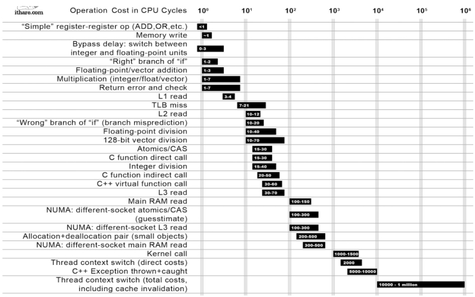

# Помощник в освоении I/O и сетевого программирования

**\[[Операционные системы](https://github.com/blinky-z/OS-Learn)\] | \[[Компьютерные сети](https://github.com/blinky-z/Computer-Networks)\] | \[I/O и сетевое программирование\]**

**Содержание:**
- [Sockets Basics](#sockets-basics)
- [Модели I/O](#модели-io)
    - [Blocking I/O](#blocking-io)
    - [Non-Blocking I/O](#non-blocking-io)
    - [I/O Multiplexing](#io-multiplexing)
    - [Signal-Driven I/O](#signal-driven-io)
        - [Signal execution](#signal-execution)
        - [Multiple signals execution](#multiple-signals-execution)
        - [Async-signal-safe functions](#async-signal-safe-functions)
            - [Synchronously accepting a signal](#synchronously-accepting-a-signal)
            - [Multiplexing signals](#multiplexing-signals)
        - [Summary](#summary)
        - [Больше про Signal-Driven I/O](#больше-про-signal-driven-io)
    - [Asynchronous I/O](#asynchronous-io)
        - [POSIX AIO](#posix-aio)
        - [Linux io\_uring](#linux-io_uring)
    - [Концептуальное сравнение I/O моделей](#концептуальное-сравнение-io-моделей)
    - [Синхронное/Асинхронное I/O](#синхронноеасинхронное-io)
- [Designing An Efficient Web Server](#designing-an-efficient-web-server)
    - [Single-Threaded Blocking I/O Server](#single-threaded-blocking-io-server)
    - [Multi-Threaded Blocking I/O Server (Thread-per-connection)](#multi-threaded-blocking-io-server-thread-per-connection)
    - [Non-Blocking I/O Server](#non-blocking-io-server)
    - [Non-Blocking Multiplexing I/O Server \[select\]](#non-blocking-multiplexing-io-server-select)
        - [Больше о select](#больше-о-select)
    - [Non-Blocking Multiplexing I/O Server \[poll\]](#non-blocking-multiplexing-io-server-poll)
        - [Больше о poll](#больше-о-poll)
    - [Non-Blocking Multiplexing I/O Server \[epoll\]](#non-blocking-multiplexing-io-server-epoll)
        - [Больше об epoll](#больше-об-epoll)
        - [Аналоги epoll в других системах](#аналоги-epoll-в-других-системах)
    - [Signal-Driven I/O Server](#signal-driven-io-server)
    - [Asynchronous I/O Server (io\_uring)](#asynchronous-io-server-io_uring)
    - [select vs poll vs epoll](#select-vs-poll-vs-epoll)
    - [Why Single-Threaded Multiplexing Model Works](#why-single-threaded-multiplexing-model-works)
        - [N kernel calls in loop](#n-kernel-calls-in-loop)
        - [Leveraging Multi-Threading](#leveraging-multi-threading)
    - [The C10K Problem](#the-c10k-problem)
    - [Use non-blocking I/O in case of multiplexing](#use-non-blocking-io-in-case-of-multiplexing)
    - [Edge-Triggered vs Level-Triggered Mode](#edge-triggered-vs-level-triggered-mode)
    - [I/O Frameworks](#io-frameworks)
        - [libuv](#libuv)
    - [Low-Level Asynchronous I/O vs Asynchronous I/O Request Processing](#low-level-asynchronous-io-vs-asynchronous-io-request-processing)
        - [Asynchronous HTTP Client Example](#asynchronous-http-client-example)
- [Многопоточность (Multithreading)](#многопоточность-multithreading)
    - [Что такое многопоточность](#что-такое-многопоточность)
    - [Что такое concurrency, parallelism](#что-такое-concurrency-parallelism)
    - [Как связаны многопоточность и concurrency](#как-связаны-многопоточность-и-concurrency)
    - [Как связаны многопоточность и parallelism](#как-связаны-многопоточность-и-parallelism)
    - [Что такое асинхронность](#что-такое-асинхронность)
        - [Как связаны асинхронность и многопоточность](#как-связаны-асинхронность-и-многопоточность)
        - [Как связаны асинхронность и concurrency](#как-связаны-асинхронность-и-concurrency)
- [Ресурсы](#ресурсы)

---

## Sockets Basics

**Сокет** - это интерфейс между user-space программой и сетевым стеком различных протоколов в ядре.

При открытии сокета мы указываем семейство протоколов и тип сокета. Например, семейство `AF_UNIX` используется для IPC (inter-process communication), а `AF_INET` используется для сетевого общения по IPv4. Два основных типа сокетов это `SOCK_STREAM` (TCP) и `SOCK_DGRAM` (UDP).

Функции для I/O на сокетах:
- [recv()](https://man7.org/linux/man-pages/man2/recv.2.html) для чтения. Если данных в *read buffer* нет, то есть другая сторона соединения еще не прислала данные, то чтение блокируется
- [send()](https://man7.org/linux/man-pages/man2/send.2.html) для записи. Если сообщение не помещается в *send buffer* сокета, то есть другая сторона соединения еще не прочитала данные, то запись блокируется

В Unix используется парадигма ["Everything is a file"](https://en.wikipedia.org/wiki/Everything_is_a_file), поэтому сокет представлен в системе обычным файловым дескриптором. Благодаря этому, например, можно использовать общие функции [read()](https://man7.org/linux/man-pages/man2/read.2.html)/[write()](https://man7.org/linux/man-pages/man2/write.2.html), предназначенные для работы с файловыми дескрипторами. В дальнейшем я буду использовать понятия "сокет" и "файловый дескриптор" взаимозаменяемо.

Читайте больше:
- [man socket(7, overview)](https://man7.org/linux/man-pages/man7/socket.7.html)
- [man socket(2, syscall)](https://man7.org/linux/man-pages/man2/socket.2.html)

---

## Модели I/O

### Blocking I/O

Данная модель использует сокеты в блокирующем режиме. Поток блокируется на вызове I/O сисколла в ожидании ответа, т.е. не происходит никакой работы, пока системный вызов I/O (read/write) не будет завершен.
- Со стороны программы и планировщика это выглядит так, что поток был заблокирован и полезной работы в нем не совершалось
- Со стороны потока это выглядит так, что ответ пришел немедленно, потому что поток заблокировался во время вызова и не работал все время ожидания ответа

Такая модель является синхронной, потому что результат приходит сразу после вызова I/O метода. Важно отметить, что сразу **не означает немедленно, в то же абсолютное время**; это означает то, что результат придет **сразу же, как будет готов ответ**, и работа программы продолжится дальше.


**Что нужно для имплементации данной модели I/O:**
- Блокирующие сокеты

**Преимущества:**
- Модель очень простая и не требует сложного кода на стороне сервера

**Недостатки:**
- Поток блокируется в ожидании I/O, хотя мог делать полезную работу

---

### Non-Blocking I/O

В данной модели мы используем сокеты в неблокирующем режиме. Поток никогда не блокируется: в зависимости от готовности I/O на вызове [read](https://man7.org/linux/man-pages/man2/read.2.html)/[write](https://man7.org/linux/man-pages/man2/write.2.html) в качестве ответа придет или количество прочитанных байт (полезный результат), или же ошибка `EAGAIN` означающая что:
- read: *Receive Buffer* пуст, то есть клиент еще не прислал нам новые данные
- write: *Send Buffer* заполнен, то есть клиент еще не прочитал ранее отправленные данные

Такая модель все еще остается синхронной, ведь результат приходит сразу же после I/O вызова, как и в случае с блокирующим синхронным I/O. Разница лишь в том, что здесь мы не всегда гарантированно получим полезный результат.

Вот как можно перевести сокет в неблокирующий режим с помощью [fcntl](https://man7.org/linux/man-pages/man2/fcntl.2.html) команды `F_SETFL`:

```C
void set_nonblocking(int sockfd) {
    int flags;
    if ((flags = fcntl(fd, F_GETFL, 0)) < 0)
        err_sys("F_GETFL error");
    if (fcntl(fd, F_SETFL, flags | O_NONBLOCK) < 0)
        err_sys("F_SETFL error");
}
```

В данной модели нам необходимо постоянно опрашивать сокет на наличие данных, что также называется *[polling](https://en.wikipedia.org/wiki/Polling_(computer_science))*. Эта модель менее эффективна, чем блокирующий синхронный I/O, потому что программа будет тратить процессорное время попусту в отличие от блокирующего I/O, где поток просто спал в ожидании результата, освобождая ресурсы CPU под другие потоки.


**Что нужно для имплементации данной модели I/O:**
- Неблокирующие сокеты

**Преимущества:**
- Поток не блокируется

**Недостатки:**
- Необходимо постоянно опрашивать дескриптор, что означает:
    - пустая трата ресурсов CPU
    - постоянный переход между user/kernel space

---

### I/O Multiplexing

Итак, как мы увидели, мы имеем возможность не блокировать поток, но это слишком дорого и неэффективно.

Мы можем решить эту проблему, *отдав работу по опрашиванию дескрипторов ядру*, которое намного эффективнее справляется с этой работой. Для этого OS предоставляет специальный механизм - *мультиплексор*. Например, в Unix-системах это [select](http://manpages.debian.net/cgi-bin/man.cgi?query=select), [poll](http://manpages.debian.net/cgi-bin/man.cgi?query=poll) и [epoll](http://www.xmailserver.org/linux-patches/epoll.txt).

Каждый мультиплексор дает как минимум следующее API:
- Регистрирование файловых дескрипторов, на которых необходимо слушать I/O операции
- Блокирующее синхронное ожидание новых событий на зарегистрированных дескрипторах. При появлении результата на каких-либо дескрипторах мультиплексор отдает управление программе, чтобы та смогла обработать все результаты

Таким образом, на стороне приложения мы регистрируем все интересующие нас файловые дескрипторы, а затем вызываем мультиплексор и засыпаем в ожидании новых данных.

Больше об использовании мультиплексоров я расскажу в разделе про дизайнинг веб-сервера.


**Что нужно для имплементации данной модели I/O:**
- Блокирующие/неблокирующие сокеты
- Мультиплексор

**Преимущества:**
- Мы больше не тратим процессорное время на polling сокетов, поток просто спит в ожидании результатов
- Не происходит постоянного переключения между user и kernel space
- Хорошо масштабируемая модель, которая поддерживает регистрацию сразу множества сокетов

**Недостатки:**
- Нет

---

### Signal-Driven I/O

В этой модели используются *[POSIX сигналы](https://en.wikipedia.org/wiki/Signal_(IPC))* для уведомления процесса о готовности I/O на файловом дескрипторе. Мы говорим ядру мониторить указанный файловый дескриптор и уведомить процесс с помощью сигнала о готовности данных на нем.

POSIX определяет два вида сигналов: reliable (standard) и real-time. По-умолчанию в модели используется стандартный сигнал `SIGIO` (сообщает о том, что I/O возможно), но можно использовать и real-time сигналы.

Давайте сразу перейдем к делу. Для того, чтобы заиспользовать данную модель, мы должны проделать следующие шаги:
1. Зарегистрировать signal handler для `SIGIO` сигнала с помощью функции [sigaction](https://man7.org/linux/man-pages/man2/sigaction.2.html):

   1. ```C
      void signal_handler(int signum, siginfo_t *info, void *context) {
          int sockfd = info->si_fd;
          long revents = info->si_band;
          if (revents & POLLIN) {
              handle_input(sockfd)
          }
      }
      
      struct sigaction act = { 0 };
      
      act.sa_flags = SA_RESTART | SA_SIGINFO;
      act.sa_handler = &signal_handler;
      if (sigaction(SIGIO, &act, NULL) == -1) {
          errExit("sigaction")
      }
      ```

   2. Обратите внимание на флаг `SA_RESTART`. Когда сигнал происходит во время того, как программа была заблокирована на системном вызове, сисколл завершается с ошибкой `EINTR`. Однако возможно сделать автоматических перезапуск многих (но не всех) сисколлов с помощью указания этого флага 
      > **SA_RESTART**
      > 
      > Provide behavior compatible with BSD signal semantics by
         making certain system calls restartable across signals.
         This flag is meaningful only when establishing a signal
         handler.  See signal(7) for a discussion of system call
         restarting.
   3. Мы указываем флаг `SA_SIGINFO` для того, чтобы при срабатывании сигнала в handler была передана дополнительная информация о сработанном сигнале в виде структуры `siginfo_t`
      1. > **SA_SIGINFO (since Linux 2.2)**
         > 
         > The signal handler takes three arguments, not one.  In
         this case, `sa_sigaction` should be set instead of
         `sa_handler`.  This flag is meaningful only when
         establishing a signal handler.
      2. В этой структуре поля `si_signo`, `si_errno` and `si_code` заполняются всегда. Остальная часть структуры является union: будут заполнены только те поля, которые относятся к конкретному сигналу. Для `SIGIO` это:
          > **SIGIO/SIGPOLL** (the two names are synonyms on Linux) fills in
         `si_band` and `si_fd`.  The `si_band` event is a bit mask containing
         the same values as are filled in the `revents` field by poll(2).
         The `si_fd` field indicates the file descriptor for which the I/O
         event occurred
2. Установить PID процесса-владельца, которому следует отправлять сигнал, с помощью fcntl команды `F_SETOWN`: `fcntl(sockfd, F_SETOWN, getpid())`
3. Включить генерацию сигнала `SIGIO` при готовности данных на слушаемом сокете, установив флаг `O_ASYNC` с помощью fcntl команды `F_SETFL`:

    ```C
    void set_async(int sockfd) {
        int flags;
        if ((flags = fcntl(fd, F_GETFL, 0)) < 0)
            err_sys("F_GETFL error");
        if (fcntl(fd, F_SETFL, flags | O_ASYNC) < 0)
            err_sys("F_SETFL error");
    }
    ```

После выполнения вышеперечисленных шагов программа может работать как обычно и делать полезную работу. При появлении сигнала он будет автоматически обработан в зарегистрированном signal handler. Мы также можем сделать так, чтобы генерировался не дефолтный `SIGIO` сигнал, а какой-нибудь другой (включая real-time) сигнал с помощью fcntl команды `F_SETSIG`. Соответственно, все так же необходимо зарегистрировать signal_handler для этого сигнала.

Эта модель является edge-triggered, то есть сообщает только о новых ивентах на дескрипторе. Поэтому с данной моделью необходимо использовать неблокирующие сокеты. Также нужно знать, что существуют spurious сигналы, то есть ложные срабатывания сигналов, и это вторая причина для использования неблокирующих сокетов вместе с данной моделью.


#### Signal execution

Давайте более подробно рассмотрим процесс обработки сигналов (выполнения signal handler).

Когда приходит сигнал, то выполнение программы прерывается. Если мы были заблокированы на сисколле, то сисколл завершится с ошибкой `EINTR`. Если же мы работали в user-space, то выполнение приостановится для обработки сигнала и затем возобновится с этого же места.

Каждый тред в процессе имеет так называемую *signal mask* - битовую маску сигналов, которые в данный момент этот тред блокирует. Если сигнал в данный момент блокируется тредом, то инстансы этого сигнала не будут доставлены до треда, пока сигнал не будет разблокирован. *Pending signal* - это такой сигнал, который был сгенерирован, но не может быть доставлен до треда из-за блокировки, то есть он ожидает разблокировки.

Мы можем посмотреть или изменить свою *signal mask* с помощью сисколлов [pthread_sigmask()](https://man7.org/linux/man-pages/man3/pthread_sigmask.3.html)/[sigprocmask()](https://man7.org/linux/man-pages/man2/sigprocmask.2.html). Например, вот как мы можем заблокировать определенный тип сигналов из программы:

```C
#include <pthread.h>
#include <signal.h>
       
sigset_t set;
sigemptyset(&set);
sigaddset(&set, SIGQUIT);
sigaddset(&set, SIGUSR1);
if (pthread_sigmask(SIG_BLOCK, &set, NULL) < 0) {
    errExit("pthread_sigmask")
}
```

Этот механизм используется и при прерывании программы обработчиком: когда приходит сигнал, то данный тип сигнала блокируется, чтобы следующий инстанс сигнала ожидал завершения обработки предыдущего инстанса. Таким образом, в один момент треда может обрабатываться только один инстанс сигнала.

#### Multiple signals execution

Стандартные сигналы имеют большой недостаток, который делает невозможным обработку множество сокетов: если было сгенерировано несколько инстансов одного типа сигнала (несколько `SIGIO` для разных сокетов), то до программы дойдет только один инстанс, причем порядок доставки не определен. Из [man signal(7)](https://man7.org/linux/man-pages/man7/signal.7.html):
> **Queueing and delivery semantics for standard signals**
>
> Standard signals do not queue.  If multiple instances of a
  standard signal are generated while that signal is blocked, then
  only one instance of the signal is marked as pending (and the
  signal will be delivered just once when it is unblocked).  In the
  case where a standard signal is already pending, the `siginfo_t`
  structure (see sigaction(2)) associated with that signal is not
  overwritten on arrival of subsequent instances of the same
  signal.  Thus, the process will receive the information
  associated with the first instance of the signal.

Real-time сигналы такой проблемой не обладают и более того они встают в очередь:
> **Real-time signals are distinguished by the following:**
>
> 1. Multiple instances of real-time signals can be queued. By contrast, if multiple instances of a standard signal are delivered while that signal is currently blocked, then only one instance is queued
> 2. Real-time signals are delivered in a guaranteed order.
     Multiple real-time signals of the same type are delivered in
     the order they were sent.

Поэтому, если мы хотим обрабатывать сразу множество сокетов, то необходимо установить генерацию real-time сигнала вместо дефолтного `SIGIO` с помощью fcntl команды `F_SETSIG`: `fcntl(sockfd, F_SETSIG, signum)`. Из fcntl(2) manual page:
> **F_SETSIG (int)**
>
> By selecting a real time signal (value >= `SIGRTMIN`), multiple I/O events may be queued using the same signal numbers.  (Queuing is dependent on available memory.) Extra information is available if `SA_SIGINFO` is set for the signal handler, as above.
>
> Note that Linux imposes a limit on the number of real-time signals that may be queued to a process (see getrlimit(2) and signal(7)) and if this limit is reached, then the kernel reverts to delivering `SIGIO`, and this signal is delivered to the entire process rather than to a specific thread.

---

#### Async-signal-safe functions

Из-за асинхронной природы сигналов и прерывания посреди программы необходимо очень аккуратно писать код обработчика.

1. В обработчике безопасно вызывать только *async-signal-safe* функции, так как многие сисколлы выполняются в несколько действий (не являются атомарными) и изменяют глобальные данные. А так как при происхождении сигнала программа прерывается handler_ом, где мы снова можем вызвать этот сисколл, то второй вызов будет оперировать неконсистентными данными. Читайте об этом в man [signal-safety(7)](https://man7.org/linux/man-pages/man7/signal-safety.7.html)
2. В обработчике нужно очень осторожно работать с shared данными, ведь ведь сигнал может произойти посреди выполнения user-space инструкций и есть риск возникновения гонки

##### Synchronously accepting a signal

Работать с сигналами можно и синхронно с помощью [sigwaitinfo()](https://man7.org/linux/man-pages/man2/sigwaitinfo.2.html) или [signalfd()](https://man7.org/linux/man-pages/man2/signalfd.2.html).

##### Multiplexing signals

Мультиплексоры имеют альтернативную версию, которая позволяет автомарно ожидать или готовности данных, или происхождения сигнала на файловом дескрипторе. Смотрите:
- [pselect(2)](https://man7.org/linux/man-pages/man2/select.2.html)
- [ppoll(2)](https://man7.org/linux/man-pages/man2/poll.2.html)
- [epoll_pwait(2)](https://man7.org/linux/man-pages/man2/epoll_wait.2.html)

---

#### Summary

**Преимущества:**
- Мы не блокируем поток, пока ждем готовности данных на сокете. В какой-то ситуации это может быть преимуществом по сравнению с мультиплексированием
- Может выступить заменой edge-triggered мультиплексора, если такого не имеется в системе

**Недостатки:**
- Ловить сигналы - дорого, поэтому эта модель плохо масштабируется
- Работать с сигналами сложно

#### Больше про Signal-Driven I/O

Signal-Driven I/O:
- [Unix Network Programming, Volume 1 - 25.2 Signal-Driven I/O for Sockets](https://www.masterraghu.com/subjects/np/introduction/unix_network_programming_v1.3/ch25lev1sec2.html)
- [GNU C Library - 13.19 Interrupt-Driven Input](https://www.gnu.org/software/libc/manual/html_node/Interrupt-Input.html)
- [GNU C Library - 24.2.4 Asynchronous I/O Signals](https://www.gnu.org/software/libc/manual/html_node/Asynchronous-I_002fO-Signals.html)

Документация по сигналам:
- [man signal(2, syscall)](https://man7.org/linux/man-pages/man2/signal.2.html)
- [man signal(7, overview)](https://man7.org/linux/man-pages/man7/signal.7.html)
- [man signal-safety(7, overview)](https://man7.org/linux/man-pages/man7/signal.7.html)
- [man sigaction(2)](https://man7.org/linux/man-pages/man2/sigaction.2.html)
- [man fcntl(2)](https://man7.org/linux/man-pages/man2/fcntl.2.html)

Синхронная обработка сигналов:
- [https://unixism.net/2021/02/making-signals-less-painful-under-linux/](https://unixism.net/2021/02/making-signals-less-painful-under-linux/)
- [https://ldpreload.com/blog/signalfd-is-useless](https://ldpreload.com/blog/signalfd-is-useless)

---

### Asynchronous I/O

В асинхронной модели I/O мы просим ядро начать операцию и уведомить нас, когда вся I/O операция завершится, включая копирование данных между user/kernel-space буферами. Это отличается от прошлых моделей тем, что теперь ядро уведомляет нас не о готовности данных на сокете, а о полном окончании операции чтения/записи. Таким образом, теперь операции I/O выполняются полностью на стороне ядра.

#### POSIX AIO

**[POSIX AIO](https://man7.org/linux/man-pages/man7/aio.7.html)** - это асинхронное I/O API, закрепленное в стандарте POSIX.

Две основные функции данного API - это `int aio_read(struct aiocb *aiocbp)` и `int aio_write(struct aiocb *aiocbp)`. Они принимают в качестве аргумента структуру *aiocb* ("asynchronous I/O control block"), которая определяет I/O операцию:

```C
#include <aiocb.h>

struct aiocb {
    /* The order of these fields is implementation-dependent */

    int             aio_fildes;     /* File descriptor */
    off_t           aio_offset;     /* File offset */
    volatile void  *aio_buf;        /* Location of buffer */
    size_t          aio_nbytes;     /* Length of transfer */
    int             aio_reqprio;    /* Request priority */
    struct sigevent aio_sigevent;   /* Notification method */
    int             aio_lio_opcode; /* Operation to be performed;
                                       lio_listio() only */

    /* Various implementation-internal fields not shown */
};
```

Например, чтобы выполнить асинхронное чтение (Input), мы должны вызвать функцию `aio_read` передав следующие параметры:
- файловый дескриптор (`aio_fildes`), указатель на буфер (`aio_buf`), размер буфера (`aio_nbytes`), что соответствует сигнатуре `read`
- file offset (`aio_offset`)
- способ уведомления об окончании I/O операции (`aio_sigevent`): с помощью уже знакомого нам *сигнала*, с помощью создания треда, или же вообще без уведомления. Валидные значения для `aio_sigevent.sigev_notify` это `SIGEV_NONE`, `SIGEV_SIGNAL`, или `SIGEV_THREAD` соответственно

Системный вызов `aio_read` возвращает управление потоку сразу не блокируясь. Сама I/O операция будет выполняться на стороне ядра. Когда программа получит сигнал, мы знаем, что I/O операция уже завершена.


**Преимущества:**
- Мы не блокируем поток и программа все время может делать полезную работу
- Требует всего лишь 1 syscall: вся операция происходит на стороне ядра; то есть нет повторного перехода из user в kernel space для чтения данных

**Недостатки:**
- Сложен в использовании
- Не эффективен
- Почти не используется в реальном мире

Больше информации про AIO:
- [man aio(7)](https://man7.org/linux/man-pages/man7/aio.7.html).
- [asynchronous disk I/O](https://blog.libtorrent.org/2012/10/asynchronous-disk-io/) - статья про неудачные попытки использования POSIX AIO/Windows overlapped I/O для файловых I/O операций
- [Lord of the io_uring: Asynchronous Programming Under Linux](https://unixism.net/loti/async_intro.html) - отличная вводная статья про Asynchronous I/O в Linux; здесь также рассказывается про недостатки AIO

#### Linux io_uring

**io_uring** - это новое API для асинхронных I/O операций в Linux, которое призвано решить недостатки aio. Доступен для использования с версии Linux Kernel 5.1

Скорее всего вы захотите использовать библиотеку [liburing](https://github.com/axboe/liburing), так как она сильно облегчает использование io_uring, предоставляя более высокоуровневое и удобное API для доступа к io_uring.

Больше информации про io_uring:
- [Lord of the io_uring](https://unixism.net/loti/index.html) и Цикл статей [io_uring By Example](https://unixism.net/2020/04/io-uring-by-example-article-series/)
- [whitepaper: Efficient IO with io_uring](https://kernel.dk/io_uring.pdf) - whitepaper про ui_uring
- [https://kernel.dk/axboe-kr2022.pdf](https://kernel.dk/axboe-kr2022.pdf) - доклад про io_uring от [Jens Axboe](https://en.wikipedia.org/wiki/Jens_Axboe)
- [IO_URING. Часть 1. Введение](https://habr.com/ru/post/589389/) - статья на Habr про ui_uring

---

### Концептуальное сравнение I/O моделей


Как мы видим, в первых четырех моделях - Blocking/Non-Blocking, Multiplexing, Signal-Driven - отличается первая фаза, где мы ожидаем данных на сокете; вторая фаза, где мы блокируемся и читаем данные из сокеты, одинакова. Асинхронное I/O же обрабатывает обе фазы и этим отличается от первых четырех моделей.

---

### Синхронное/Асинхронное I/O

Какой же является каждая из рассмотренных I/O моделей - синхронной или асинхронной?

POSIX определяет эти термины как следующие:
> - A synchronous I/O operation causes the requesting process to be blocked until that I/O operation completes
> - An asynchronous I/O operation does not cause the requesting process to be blocked

IO вызов является синхронным, если при вызове IO операции контроль программе не возвращается, пока операция не будет завершена, или пока не пройдет некоторое время по которому операция упадет по таймауту. Во всех первых четырех моделях мы вызываем `read`/`recv` синхронно и ждем, пока операция не будет завершена. Не важно, в каком режиме сокет - блокирующем, неблокирующем (O_NONBLOCK) или асинхронном (signal-driven, O_ASYNC) - мы все равно делаем чтение синхронно.

Используя эти определения, первые четыре модели I/O является *синхронными*, потому что I/O операция блокирует тред. И только асинхронная I/O модель удовлетворяет определению *асинхронного I/O*, ведь мы только инициируем I/O и не ожидаем ее завершения.

---

## Designing An Efficient Web Server

В данной главе мы будем дизайнить веб-сервер и в ходе этого:
1. Поговорим побольше про практическое применение всех рассмотренных моделей I/O
2. Рассмотрим преимущества и недостатки каждой из моделей
3. Рассмотрим разные мультиплексоры - select, poll, epoll
4. Пройдем путь от самой простой и неэффективной до самой эффективной имплементации веб сервера

Сразу оговорюсь, что мы говорим про высоконагруженный сервер, обрабатывающий одновременно сотни тысяч соединений.

### Single-Threaded Blocking I/O Server

Дизайн:
- *I/O*:
    - Блокирующие сокеты (Blocking I/O)
- *Concurrency Model*:
    - Single-Threaded

В данной модели мы постоянно слушаем новые соединения на мастер сокете и добавляем их в список слушаемых соединений.

Затем в цикле мы слушаем и читаем данные из открытых блокирующих сокетов:

```C
char buf[1024];
int i, n;
while (1) {
    for (i=0; i<n_sockets; ++i) {
        n = recv(fd[i], buf, sizeof(buf), 0);
        if (n==0)
            handle_close(fd[i]);
        else if (n<0)
            handle_error(fd[i], errno);
        else
            handle_input(fd[i], buf, n);
    }
}
```

Эта модель очень неэффективна, так как мы поочередно блокируемся на каждом сокете, начиная с первого, пока там не окажется данных, хотя на последующих сокетах могли быть уже готовы данные, например на `fd[2]`.

Решить эту проблему можно с помощью использования многопоточности.

---

### Multi-Threaded Blocking I/O Server (Thread-per-connection)

Дизайн:
- *I/O*:
    - Блокирующие сокеты (Blocking I/O)
- *Concurrency Model*:
    - Multi-Threaded + Thread-Pool

В данной модели при принятии нового соединения мы создаем новый OS тред для обслуживания этого соединения. Теперь, так как каждое соединение имеет свой отдельный поток, то блокирующий I/O вызов не аффектит другие потоки. Однако, создавать OS треды - дорого по ресурсам, поэтому мы заводим так называемый *Thread Pool*, в котором храним уже созданные треды и переиспользуем их для разных запросов.

Это старая, простая и вполне рабочая модель, на которой построен как минимум популярный Java сервер [Tomcat](https://en.wikipedia.org/wiki/Apache_Tomcat), но она плохо масштабируется и не способна обрабатывать большое количество соединений.

Ее недостатки заключаются в следующем:
- Блокирующие I/O операции блокируют поток, не давая ему выполнять полезную работу - тред просто простаивает в ожидании блокирующего вызова и он не делает полезной работы. Это не было бы проблемой, если бы могли создавать треды бесконечно и дешево, но
- Мы не можем создавать треды бесконечно, так как:
    - Мы ограничены по памяти
    - С ростом количества тредов возрастает concurrency между тредами
    - Большое concurrency означает большие траты на context switch между тредами
- Таким образом, так как мы имеем верхний порог количества тредов, то с ростом количества соединений все больше клиентов будет ожидать обслуживания, пока освободится какой-нибудь тред
- Долгие запросы надолго занимают тред, не давая время другим запросам. Да, планировщик ОСи все равно дает всем тредам равнозначное время, но ведь если запрос долгий, то один тред все равно будет занят все время выполнения долгого запроса

Применение:
- Если нагрузка неощутимая и нет проблем с обработкой запросов с использованием такой модели
- Если инфраструктура не в клауде, а на собственных купленных серверах/RAM, и нет задачи максимальной утилизации CPU

Примеры:
- Tomcat

---

### Non-Blocking I/O Server

Дизайн:
- *I/O*:
    - Неблокирующие сокеты (Non-Blocking I/O)
- *Concurrency Model*:
    - Single-Threaded

Итак, мы увидели, что модель thread-per-connection плохо масштабируется. Стоит попробовать что-нибудь ещё.

Вернемся к нашим non-blocking сокетам. Проблема Single-Threaded Blocking I/O модели была в том, что мы не могли опрашивать все сокеты, так как блокировались на первом же сокете. Однако, если мы возьмем неблокирующие сокеты, то сможем опрашивать все сокеты:

```C
int i, n;
char buf[1024];
for (i=0; i < n_sockets; ++i)
    fcntl(fd[i], F_SETFL, O_NONBLOCK);

while (1) {
    for (i=0; i < n_sockets; ++i) {
        n = recv(fd[i], buf, sizeof(buf), 0);
        if (n == 0) {
            handle_close(fd[i]);
        } else if (n < 0) {
            if (errno == EAGAIN)
                 ; /* The kernel didn't have any data for us to read. */
            else
                 handle_error(fd[i], errno);
         } else {
            handle_input(fd[i], buf, n);
         }
    }
}
```

Однако, все еще плохо и стало даже хуже. Недостатки этой модели заключаются в следующем:
- Мы попусту тратим процессорное время, крутясь в цикле и опрашивая все сокеты, когда данных для чтения может даже не быть
- Для каждого сокета при опросе мы делаем отдельный syscoll, даже если там нет данных, что выливается в N сиколлов от количества сокетов за один полный цикл, что означает постоянный дорогой переход между user и kernel space

Как мы рассматривали выше, решить эту проблему можно с помощью мультиплексирования I/O.

---

### Non-Blocking Multiplexing I/O Server \[select\]

Дизайн:
- *I/O*:
    - Неблокирующие сокеты (Non-Blocking I/O)
    - I/O Multiplexing - [select](https://man7.org/linux/man-pages/man2/select.2.html)
- *Concurrency Model*:
    - Single-Threaded

Ранее мы узнали, что можем отдать работу по отслеживанию готовности данных на сторону ядру с помощью мультиплексирования I/O. Возьмем для этой модели самый старый, но поддерживаемый абсолютно на всех платформах мультиплексор [select](https://man7.org/linux/man-pages/man2/select.2.html):

```C
#include <sys/select.h>

int select(int nfds, fd_set *restrict readfds, fd_set *restrict writefds, fd_set *restrict exceptfds, struct timeval *restrict timeout);
```

Тогда код будет выглядеть так:

```C
int n_sockets, fd[n_sockets]; /* sockets */
int i, n;
char buf[1024];

fd_set readset;
while (1) {
    int maxfd = -1;
    FD_ZERO(&readset);

    /* Add all of the interesting fds to readset */
    for (i=0; i < n_sockets; ++i) {
         if (fd[i]>maxfd) maxfd = fd[i];
         FD_SET(fd[i], &readset);
    }

    /* Wait until one or more fds are ready to read */
    select(maxfd+1, &readset, NULL, NULL, NULL);

    /* Process all of the fds that are still set in readset */
    for (i=0; i < n_sockets; ++i) {
        if (FD_ISSET(fd[i], &readset)) {
            n = recv(fd[i], buf, sizeof(buf), 0);
            if (n == 0) {
                handle_close(fd[i]);
            } else if (n < 0) {
                if (errno == EAGAIN)
                     ; /* The kernel didn't have any data for us to read. */
                else
                     handle_error(fd[i], errno);
             } else {
                handle_input(fd[i], buf, n);
             }
        }
    }
}
```

Мы заполняем сутруктуру fd_set интересующими нас сокетами и блокируемся на вызове сисколла `select`. Мультиплексор не отдаст контроль программе, пока не появятся данные на сокетах. После возвращения контроля в переданном `readset` будут лежать те файловые дескрипторы, на которых появились данные. Нам остается только пройтись по сету и собрать данные с них.

Кажется, уже лучше. Однако, `select` - очень старый и неэффективный механизм:
- Плохая масштабируемость: select на стороне ядра работает за `O(n)` от значения самого большого файлового дескриптора `maxfd`, который обычно равен суммарному количеству всех открытых файловых дескрипторов во всей программе, в независимости от того, сколько fd было добавлено в отслеживаемый сет
- Перед каждым новым вызовом `select()` нам необходимо обнулять (`FD_ZERO`) и снова зполнять fd_set нужными дескрипторами (`FD_SET`), так как select изменяет переданный ему сет, оставляя в нем только те сокеты, на которых появились данные
- `select` имеет лимит на количество сокетов, равное `FD_SETSIZE`, которое забито в библиотеке. Некоторые версии GNU C Library позволяют вам изменить лимит в compile-time. В ранних версиях Linux этот лимит был равен 1024
- Между kernel и user-space постоянно копируется fd_set

У нас есть более лучший мультиплексор - `poll`. Давайте рассмотрим модель построенную на нем.

#### Больше о select

- [man select](https://man7.org/linux/man-pages/man2/select.2.html)
- [UNIX Network Programming Book: Section 6.3 select Function](https://www.masterraghu.com/subjects/np/introduction/unix_network_programming_v1.3/ch06lev1sec3.html)
- Расширенные заметки о select - [Multiplexing.MD#select](./Multiplexing.MD#select)

---

### Non-Blocking Multiplexing I/O Server \[poll\]

Дизайн:
- *I/O*:
    - Неблокирующие сокеты (Non-Blocking I/O)
    - I/O Multiplexing - [poll](https://man7.org/linux/man-pages/man2/poll.2.html)
- *Concurrency Model*:
    - Single-Threaded

В этой модели мы возьмем пультиплексор *poll*:

```C
#include <poll.h>

int poll(struct pollfd *fds, nfds_t nfds, int timeout);
```

Poll обладает следующими преимуществами по сравнению с select:
- все так же работает за `O(n)`, но теперь эта работа зависит от количества переданных сокетов, а не от значения максимального файлового дескриптора
- не имеет ограничения на количество сокетов

Список файловых дескрипторов передается в аргументе `fds`, который является массивом структур `pollfd`:

```C
struct pollfd {
  int   fd;         /* file descriptor */
  short events;     /* requested events */
  short revents;    /* returned events */
};
```

Также мы должны указать количество файловых дескрипторов в аргументе `nfds` и таймаут ожидания в `timeout`.

Пример использования poll:

```C
int n_sockets, fd[n_sockets]; /* sockets */
int i, n;
char buf[1024];

struct pollfd pfds[n_sockets];
/* Add all of the interesting fds to pollfd */
for (i=0; i < n_sockets; ++i) {
     pfds[i].fd = fd[i];
     pfds[i].events = POLLIN; // we are interested in input operation
}

while (1) {
    /* Wait until one or more fds are ready to read */
    poll(pfds, n_sockets, -1);

    /* Process all of the fds that have POLLIN set in returned events*/
    for (i=0; i < n_sockets; ++i) {
        if (pfds[i].revents != 0) {
            if (pfds[i].revents & POLLIN) {
                n = recv(pfds[i].fd, buf, sizeof(buf), 0);
                if (n == -1)
                    if (errno == EAGAIN)
                         ; /* The kernel didn't have any data for us to read. */
                    else
                         handle_error(pfds[i].fd, errno);
                handle_input(pfds[i].fd, buf, n);
            } else { /* POLLERR | POLLHUP */
                handle_close(pfds[i].fd);
            }
        }
    }
}
```

Можно ли улучшить эту модель веб сервера? Да, можно, ведь есть еще более эффективный новый мультиплексор - *epoll*.

#### Больше о poll

- [man poll](https://man7.org/linux/man-pages/man2/poll.2.html)
- [UNIX Network Programming Book: Section 6.10 poll Function](https://www.masterraghu.com/subjects/np/introduction/unix_network_programming_v1.3/ch06lev1sec10.html)
- Расширенные заметки о poll - [Multiplexing.MD#poll](./Multiplexing.MD#poll)

---

### Non-Blocking Multiplexing I/O Server \[epoll\]

Дизайн:
- *I/O*:
    - Неблокирующие сокеты (Non-Blocking I/O)
    - I/O Multiplexing - [epoll](https://man7.org/linux/man-pages/man7/epoll.7.html)
- *Concurrency Model*:
    - Single-Threaded

*Epoll* - это самый эффективный из всех возможных мультиплексоров в Linux, который работает за время O(1) в независимости от количества сокетов, в отличии от select и poll, которые на уровне ядра делают поллинг всех сокетов.

- epoll не делает поллинг сокетов, а работает на основе сигналов в ядре: каждый раз, когда на файловый дескриптор поступают данные (через ядро), epoll отслеживает это и сохраняет этот файловый дескриптор. Когда в следующий раз мы вызовем мультиплексор, то он вернет все файловые дескрипторы, для которых сработали коллбеки на момент вызова. То есть, мультиплексор больше не делает поллинг файловых дескрипторов, а просто мониторит коллбеки. Именно поэтому epoll работает за время O(1), так как не важно сколько у нас файловых дескрипторов - мультиплексор всегда отдаст ответ за константное время, ведь он постоянно в пассивном режиме поддерживает у себя список готовых к I/O файловых дескрипторов.
- epoll отслеживает закрытие файлового дескриптора и автоматически удаляет его из списка отслеживаемых
- epoll позволяет эффективно добавлять сокеты динамически в множество; и позволяет это делать даже тогда, когда поток заблокирован в ожидании ивентов - это может пригодиться, если мы принимаем соединения в параллельном треде

Для управления epoll предоставляется следующее API:
1. [epoll_create](https://man7.org/linux/man-pages/man2/epoll_create.2.html) создает новый инстанс epoll и возвращает файловый дескриптор, который служит как интерфейс к epoll
2. [epoll_ctl](https://man7.org/linux/man-pages/man2/epoll_ctl.2.html) служит для регистрирования интересующего нас файлового дескриптора - epoll будет отслеживать этот файловый дескриптор
3. [epoll_wait](https://man7.org/linux/man-pages/man2/epoll_wait.2.html) - блокирующий вызов ожидания новых I/O ивентов. Если таковых еще не имеется, то поток блокируется. Этот сисколл возвращает все файловые дескрипторы, на которых имеются данные

Пример использования epoll:

```C
#define MAX_EVENTS 1000

int n_sockets, fd[n_sockets]; /* sockets */
int i, n;
char buf[1024];

int epfd = epoll_create(1);

/* Add all of the interesting fds to epoll */
for (i=0; i < n_sockets; ++i) {
    struct epoll_event ev;
    ev.data.fd = fd[i];
    ev.events = EPOLLIN; // we are interested in input operation
    epoll_ctl(epfd, EPOLL_CTL_ADD, fd[i], &ev);
}

struct epoll_event events[MAX_EVENTS];

while (1) {
    nfds = epoll_wait(epfd, events, MAX_EVENTS, -1);
    if (nfds == -1) {
        errExit("epoll_wait");
    }
    
    /* Process all of the returned fds*/
    for (i=0; i < nfds; ++i) {
        n = recv(events[i].data.fd, buf, sizeof(buf), 0);
        if (n == -1)
            if (errno == EAGAIN)
                 ; /* The kernel didn't have any data for us to read. */
            else
                 handle_error(events[i].data.fd, errno);
        handle_input(events[i].data.fd, buf, n);
    }
}
```

Чтобы сделать эту модель еще эффективнее, можно заиспользовать edge-triggered режим epoll - об этом расскажу далее.

Примеры:
- Node.js
- Netty (на самом деле netty использует сразу несколько тредов, чтобы распределить нагрузку между несколькими параллельными тредами)

#### Больше об epoll

- [man epoll](https://man7.org/linux/man-pages/man7/epoll.7.html)
- [https://github.com/frevib/epoll-echo-server](https://github.com/frevib/epoll-echo-server) - пример echo сервера на epoll

#### Аналоги epoll в других системах

Epoll существует только в Linux, однако другие системы имеют его аналоги работающие также за O(1) - например `kqueue` в BSD системах, `event ports` или `/dev/poll` в Solaris.

---

### Signal-Driven I/O Server

Signal-Driven I/O очень дорогая и сложная модель, которая не имеет преимуществ по сравнению с мультиплексированием при дизайне веб-сервера. Поэтому такой веб-сервер рассматривать не имеет смысла.

---

### Asynchronous I/O Server (io_uring)

Пока что io_uring не так хорошо адаптирован в Linux и нет популярных серверов построенных на нем.

Однако, io_uring вполне может составить конкуренцию epoll - смотрите [бенчмарки](https://github.com/frevib/io_uring-echo-server/blob/io-uring-feat-fast-poll/benchmarks/benchmarks.md) echo серверов на epoll vs io_uring:

**io_uring with IORING_FEAT_FAST_POLL** (requests/second)

| clients    | 1     | 50     | 150    | 300    | 500    | 1000   |
|:----------:|:-----:|:------:|:------:|:------:|:------:|:------:|
| 128 bytes  | 13093 | 147078 | 190054 | 216637 | 211280 | 173343 |
| 512 bytes  | 13140 | 150444 | 193019 | 203360 | 194701 | 156880 |
| 1000 bytes | 14024 | 140248 | 178638 | 200853 | 183845 | 143810 |

**epoll** (requests/second)

|  clients       | 1     | 50     | 150    | 300    | 500    | 1000   |
|:--------------:|:-----:|:------:|:------:|:------:|:------:|:------:|
|  128 bytes     | 13177 | 139863 | 152561 | 145517 | 125402 | 108380 |
|  512 bytes     | 13190 | 135973 | 147153 | 142518 | 124584 | 107257 |
|  1000 bytes    | 13172 | 131773 | 142481 | 131748 | 123287 | 102474 |

Пример сервера на io_uring - [https://github.com/frevib/io_uring-echo-server](https://github.com/frevib/io_uring-echo-server).

---

### select vs poll vs epoll

В какой ситуации выбирать каждый из мультиплексоров?

1. **epoll**
   - Всегда, если доступен
2. **poll**
    - Требуется поддержка платформ кроме Linux, а значит, невозможна работа с epoll, который эксклюзивен для Linux
3. **select**
   - Портативность приложения. Select - самый старый механизм мультиплексирования из доступных, поэтому можно быть полностью уверенным, что на каждой машине, где будет запускаться программа, данный механизм мультиплексирования будет поддерживаться

---

### Why Single-Threaded Multiplexing Model Works

Вы наверное спросите, но разве это эффективно обрабатывать все дескрипторы в единственном потоке с использованием мультиплексора?

Да, это эффективно по следующим причинам:
1. Мы больше не блокируемся на вызовах чтения/записи на сокетах, т.к. точно знаем, что данные там есть. А значит тред делает всегда полезную работу
2. Да, мы блокируемся на вызове мультиплексора, но это наоборот эффективно, так как мы не тратим ресурсы CPU, пока новых данных нет
3. У нас больше нет таких огромных трат циклов CPU на context switch по сравнению с моделью thread-per-request. А ведь чем больше запросов, тем больше возрастает и конкурретность, а соответственно и траты на context switch

Посмотрите на стоимость различных операций в циклах CPU:


Траты на context switch просто огромны - он стоит как минимум в 10 раз дороже чем kernel call! Избавление от context switch позволяет нам очень сильно выиграть в производительности программы.

#### N kernel calls in loop

Итак, мы получили ивенты от мультиплексора, проходимся по всем ним и читаем с них данные, вызывая сисколл [read()](https://man7.org/linux/man-pages/man2/read.2.html). Возникает закономерный вопрос: разве это эффективно делать N довольно дорогих сисколлов в цикле?

Да, сисколлы действительно дорогие. И хоть они стоят на порядок меньше чем context switch, но траты все равно есть.

Есть ли решение? В Single-Threaded Multiplexing I/O модели сервера нет. С этим ничего не сделать: читать данные с сокетов все равно нужно, а значит всегда будут и сисколлы.

Однако, с использованием *io_uring* возможно сделать сервер, который будет делать ровно 0 сисколлов на каждый запрос - читайте [Stupid tricks with io_uring: a server that does zero syscalls per request](https://wjwh.eu/posts/2021-10-01-no-syscall-server-iouring.html).

---

#### Leveraging Multi-Threading

Я привел эффективную, но очень простую однопоточную модель веб сервера с использованием epoll. На самом деле, мы можем получить выигрыш в производительности от многопоточности, если имеем несколько процессорных ядер. В реальной практике сервер обычно будет спроектирован следующим образом:
- **Listener** - это поток, который постоянно слушает новые соединения и отправляет этот коннекшен в *I/O Worker*
- **I/O Worker(s)** - это один или несколько тредов, в которых запущен epoll - эти воркеры постоянно крутятся в лупе (event loop), ожидая новых ивентов на дескрипторах и обрабатывая их. Они принимают новые соединения от Listener и динамически добавляют их в epoll с помощью `epoll_ctl`. Таким образом, мы можем использовать не один поток с мультиплексором, а несколько, распараллеливая обработку соединений на несколько тредов
- **Thread Pool** - это один или несколько тредов, которые предназначены для выполнения долгих или блокирующих операций

---

### The C10K Problem

*The C10K Problem* - проблема обработки большого количества одновременных соединений. Это понятие, которое возникло когда-то давно с ростом нагрузки веб серверных приложений.

На эту тему есть отличная статья - [The C10K Problem](http://www.kegel.com/c10k.html),- советую почитать, в ней рассказывается про варианты дизайна веб-сервера, с преимуществами и недостатками каждой модели, а также есть и про модели I/O.

---

### Use non-blocking I/O in case of multiplexing

Во всех своих моделях с мультиплексором я использовал неблокирующие сокеты. Почему так?

Первая причина заключается в том, что нотификация от edge-triggered мультиплексора о готовности данных на сокете - это всего лишь подсказка (hint). На самом деле дескриптор может быть больше не готов к I/O, когда вы попытаетесь прочитать из него. Поэтому важно использовать неблокирующий режим I/O при использовании мультиплексоров - при отсуствии данных мы получим ошибку `EAGAIN`, а не заблокируем тред.

Вторая причина заключается в том, что обычно мы хотим прочитать как можно больше или полностью все данные из сокета, которые там присутствуют. Дело в том, что если на сокете все еще доступны данные для чтения, то мультиплексор всегда будет возвращать ивент на данном сокете, хотя других ивентов могло не быть. Мы не хотим постоянного возвращения из ожидания мультиплексора - это просто неэффективно, так как слишком часто переключаемся между user/kernel space, хотя на других дескрипторах могло не быть новых данных. Мы хотим максимально эффективно использовать мультиплексор и за один сисколл вызова мультиплексора принимать как много больше готовых дескрипторов. Например, для чтения 64 kB данных с помощью буфера размером 1 kb у нас может уйти или 128 сисколла (64 вызова мультиплексора и 64 чтения по 1 kb после каждого вызова), если не читать все данные, или же 65 сисколлов (1 вызов мультиплексора и 64 сискола для чтения).

Итак, мы хотим прочитать все данные из сокета. Однако, при чтении мы используем буфер определенного размера, и поэтому нам может понадобиться несколько вызовов [read](https://man7.org/linux/man-pages/man2/read.2.html)/[recv](https://man7.org/linux/man-pages/man2/recv.2.html) для чтения, если размер данных больше размера буфера. Если использовать сокет в блокирующем режиме, то мы точно заблокируемся на каком-нибудь чтении, когда данных для чтения больше не окажется. Но этого можно избежать, если использовать неблокирующие сокеты - мы просто читаем до тех пор, пока вызов не вернет ошибку `EAGAIN`, которая означает, что буфер чтения пуст, то есть данных для чтения не осталось.

Также неблокирующие сокеты необходимо обязательно использовать с edge-triggered режимом epoll.

---

### Edge-Triggered vs Level-Triggered Mode

Еще одна особенность epoll в том, что он может работать как в edge-triggered режиме, так и level-triggered аналогично поведению select и poll.

В **edge-triggered** режиме epoll возвращает только те дескрипторы, на которых произошли новые ивенты; то есть epoll отслеживает только тот факт, что файловый дескриптор *стал доступен для I/O*.
А в **level-triggered** режиме ядро постоянно отслеживает статус файловых дескрипторов и возвращает те дескрипторы, на которых *в настоящий момент доступно I/O* - это поведение полностью соответствует поведению select и poll и является дефолтным поведением epoll.

Edge triggered режим имеет преимущество по перформансу: ядру больше не нужно отслеживать состояние файловых дескрипторов, доступны ли для них еще данные для чтения, а оно отслеживает только новые коллбеки.

Edge-triggered режим можно включить, передав специальный флаг `EPOLLET` при регистрировании сокета:

```C
struct epoll_event ev;
ev.data.fd = fd[i];
ev.events = EPOLLIN | EPOLLET;
epoll_ctl(epfd, EPOLL_CTL_ADD, fd[i], &ev);
```

Для большего понимания давайте разберем на примере:
1. Зарегистрирован файловый дескриптор rfd, на котором мы ожидаем данные для чтения (EPOLLIN)
2. Клиент пишет в сокет 2 kB данных
3. Выполнено ожидание новых событий `epoll_wait`, и нам вернулся этот файловый дескриптор
4. Программа читает 1 kB данных из rfd
5. Снова выполняется вызов `epoll_wait`

В зависимости от выбранного режима, мы можем или сразу вернуться из ожидания или же заблокироваться на шаге 5:
- *edge-triggered*: мы блокируемся на вызове `epoll_wait`, не смотря на то, что данные для чтения все еще присутствуют, ведь в user space мы прочитали не все данные из дескриптора
- *level-triggered*: мы сразу же возвращаемся из ожидания, так как на сокете все еще есть данные для чтения

Хотя edge-triggered режим производительнее, чем level-triggered, он требует специальной обработки в user space:
1. Необходимо использовать неблокирующий режим сокета (`O_NONBLOCK`)
2. Необходимо писать ([write](https://man7.org/linux/man-pages/man2/write.2.html)) или читать ([read](https://man7.org/linux/man-pages/man2/read.2.html) данные до тех пор, пока вызов не вернет `EAGAIN`

Если этого не сделать, то может возникнуть такая ситуация, когда мы не прочитали все данные и заблокировались снова, но в то же время клиент уже мог отправить все данные и ожидает ответа. То есть, новых ивентов на этом дескрипторе не наступит, а значит мы никогда не обработаем этот сокет - возникает starvation.

---

### I/O Frameworks

Для написания собственного веб-сервера мы можем не использовать напрямую все эти мультиплексоры, а воспользоваться I/O фреймворками, которые предоставляют удобный высокоуровневый toolkit для обработки I/O.

I/O фреймворки решают сразу множество проблем:
- Скрытие деталей имплементации и предоставление единого API для обработки I/O: нам не нужно думать о блокирующем/неблокирующем режиме сокета или используемом мультиплексоре. I/O фреймворк под капотом всегда постарается использовать самую производительную модель I/O и как можно эффективнее работать с I/O
- Платформо-переносимость. К сожалению, не существует единого эффективного мультиплексера, который существовал бы на каждой платформе. Linux имеет `epoll`, BSD-системы имеют `kqueue`, а Solaris имеет `evports` и `/dev/poll`. Более того, на какой-то платформе может вообще не существовать даже `poll`. И только select как самый древний мультиплексор может быть поддержан везде. Если мы хотим, чтобы наш сервер работал сразу на множестве платформ, то нам придется писать Platform-specific код, используя различные мультиплексоры в зависимости от платформы
- Предоставление удобной парадигмы работы с I/O. Чаще всего это асинхронная event-driven парадигма, так как она хорошо ложится на обработку I/O, а не императивная, которую мы использовали в примерах выше. Важно заметить, что это не означает то, что под капотом будет использоваться асихронная модель I/O (как io_uring), а только то, что наш I/O запрос будет обработан каким-то образом асинхронно. Мы говорим, что хотим слушать данный сокет и при появлении данных на нем необходимо выполнить указанный event handler. Обычно все фреймворки используют под капотом epoll (или аналоги) и при готовности данных на сокете вызывают event handler

Примеры I/O фреймворков:
- [libevent](https://libevent.org/)
    - Описание с официальной страницы:
    > Currently, libevent supports /dev/poll, kqueue(2), event ports, POSIX select(2), Windows select(), poll(2), and epoll(4). The internal event mechanism is completely independent of the exposed event API, and a simple update of libevent can provide new functionality without having to redesign the applications. As a result, Libevent allows for portable application development and provides the most scalable event notification mechanism available on an operating system.
- [libev](https://github.com/enki/libev)
    - Описание с официальной страницы:
    > libev is a high-performance event loop/event model with lots of features.
    - [Бенчмарк сравнения libevent и libev](http://libev.schmorp.de/bench.html)
- [libuv](https://github.com/libuv/libuv)
    - > libuv is a multi-platform support library with a focus on asynchronous I/O
    - libuv был создан специально для Node.js с целью обеспечения работы на Windows:
    - > The node.js project began in 2009 as a JavaScript environment decoupled from the browser. Using Google’s V8 and Marc Lehmann’s libev, node.js combined a model of I/O – evented – with a language that was well suited to the style of programming; due to the way it had been shaped by browsers. As node.js grew in popularity, it was important to make it work on Windows, but libev ran only on Unix. The Windows equivalent of kernel event notification mechanisms like kqueue or (e)poll is IOCP. libuv was an abstraction around libev or IOCP depending on the platform, providing users an API based on libev. In the node-v0.9.0 version of libuv libev was removed.
- [ASIO](http://think-async.com/Asio/)

#### libuv

Я разобрал libuv подробно в отдельной заметке. Смотрите [Multiplexing.MD#libuv](./Multiplexing.MD#libuv)

---

### Low-Level Asynchronous I/O vs Asynchronous I/O Request Processing

Здесь я бы хотел обсудить понятия асинхронного I/O в высокоуровневых фреймворках и клиентах. Много высокоуровневых I/O фреймворков и HTTP клиентов предоставляют возможность асинхронной обработки I/O запросов, и часто это именуется как "асинхронное I/O".

Однако, это не совсем корректно так говорить: следует отличать низкоуровневую асинхронную модель I/O по типу aio/io_uring в Linux и *асинхронную обработку I/O запросов*. Когда мы говорим про асинхронное I/O в высокоуровневых фреймворках, мы имеем в виду *асинхронную обработку*. Например, если взять асинхронный HTTP клиент, то мы не знаем, какая low-level модель I/O используется под капотом - нам лишь гарантируется, что запрос будет обработан асинхронно, не блокируя текущий тред. Однако, обычно там под капотом будет epoll + non-blocking сокеты (в Linux), потому что если нам приходится обращаться за помощью к асинхронному клиенту, то обычный блокирующий клиент с тред пулом нас уже не устраивают по причине низкого throughput, а именно асинхронные клиенты призваны решить проблему блокирующих клиентов, поэтому в здравом уме никто не будет использовать блокирующее I/O с тред пулом под капотом в таком клиенте.

Существует 3 популярных способа обработки готового результата: коллбеки, promise и reactive streams.

Но вообще, понятно почему это именуют асинхронным I/O - ведь со стороны разработчика (программы), который использует асинхронный http client, это так и выглядит - есть синхронный (блокирующий) http client, а есть асинхронный - и последний позволяет сделать I/O (сетевой запрос) асинхронно.

#### Asynchronous HTTP Client Example

Давайте рассмотрим на примере, как использовать асинхронный HTTP Client. Я возьму [HTTP Client](https://openjdk.org/groups/net/httpclient/)) из Java 11, который предоставляет возможность асинхронной обработки HTTP запросов. Данный HTTP Client использует под капотом Selector из Java NIO API, который является абстракцией над системным мультиплексором (epoll).

Полный пример:

```kotlin
val executor: ExecutorService = Executors.newSingleThreadExecutor { r ->
  val thread = Thread(r)
  thread.name = "http-client-executor"
  thread
}
val httpClient: HttpClient = HttpClient.newBuilder()
  .executor(executor)
  .build()

val request: HttpRequest = HttpRequest.newBuilder()
  .uri(URI("https://example.com"))
  .GET()
  .build()

val completableFuture: CompletableFuture<Void> = httpClient
  .sendAsync(request) {
    println("${Thread.currentThread().name}: handling response body")
    BodySubscribers.ofString(StandardCharsets.UTF_8)
  }
  .thenAcceptAsync { println("${Thread.currentThread().name}: got response") }
completableFuture.join()
```

Если вызвать данную программу, то мы получим такой лог:

```text
http-client-executor: handling response body
ForkJoinPool.commonPool-worker-1: got response
```

Как мы видим, HttpClient обрабатывает тело ответа в отдельном Executor (`http-client-executor`), чтобы обезопасить event loop тред от потенциально долгой работы, но это детали работы данного клиента.

Самое главное, что результат запроса автоматически обрабатывается в `ForkJoinPool.commonPool` благодаря `CompletableFuture`, и все это происходит асинхронно.

---
---

## Многопоточность (Multithreading)

Здесь расскажу немного про важные базовые концепты многопоточности.

### Что такое многопоточность

**Многопоточность** (Multithreading) - это технология, которая позволяет сосуществовать множеству тредов внутри одного процесса.

Треды, принадлежащие к одному процессу, имеют общий доступ к памяти процесса (shared memory). Такой общий доступ и полезен, и опасен одновременно, потому что если два треда работают с одной и той же переменной или объектом, это может вызывать ошибки в программе. Поэтому мы используем *примитивы синхронизации* для синхронизирования тредов так, чтобы они изменяли ресурс последовательно, а не параллельно.

### Что такое concurrency, parallelism

- **Concurrency** - означает то, что треды **работают вместе, прерываясь** - какой-то промежуток времени работает один тред, затем другой. Отсюда и название - треды *конкурируют* между собой
- **Parallelism** - означает то, что треды работают **одновременно**. Для этого нужен многоядерный процессор, на одноядерном такое невозможно

Обе технологии на примере:

<figure>
    
    <figcaption>Сверху Concurrency, снизу Parallelism</figcaption>
</figure>

Замечу, parallelism не исключает Concurrency: треды могут конкурировать между собой и на многоядерном процессоре, если тредов больше чем ядер, что является вполне обычной ситуацией для приложений.

### Как связаны многопоточность и concurrency

В многопоточном приложении обычно количество тредов больше чем количество ядер процессора, поэтому треды обязательно будут конкурировать между собой. Соответственно, мы получаем concurrency: один промежуток времени выполняется один тред, затем другой, и таким образом треды будут сменять друг друга в пределах одного ядра процессора.

То есть, если имеется 4-ядерный процессор - то выполняется 4 треда параллельно, а остальные ожидают своей очереди. Ни один тред не получит больше времени, чем положено - за это отвечает планировщик ОСи.

### Как связаны многопоточность и parallelism

Если мы имеем многоядерный процессор, то треды могут выполняться одновременно (параллельно) на нескольких ядрах.

---

### Что такое асинхронность

**Асинхронность** можно определить по-разному, но смысл тот же:
- Мы выражаем интерес в какой-то операции в один момент программы, а обрабатываем результат в другой момент в программе, и между этими двумя инструкциями мы выполняли другие инструкции
- Это выполнение задачи в фоне, в каком-то внешнем для текущего потока обработчике, будь то другой тред, процесс или даже компьютер. В любом случае, инициировавший асинхронную задачу поток продолжит работать дальше, делая полезную работу. Мы можем или проверить окончание выполнения задачи позже, или же получить результат выполнения задачи в виде ивента, в зависимости от используемой парадигмы, библиотеки и языка

Сравните: в синхронной операции мы выражаем интерес в один момент программы и получаем результат в тот же момент

#### Как связаны асинхронность и многопоточность

Ассинхронная работа задач может быть достигнута путем передачи задачи другому треду.

#### Как связаны асинхронность и concurrency

Так как асинхронных операций может быть множество, то они будут выполняться concurrently.

---

## Ресурсы

Книги:
- [Unix Network Programming, Volume 1: The Sockets Networking API](https://www.amazon.com/Unix-Network-Programming-Sockets-Networking/dp/0131411551)
- [The Linux Programming Interface](https://man7.org/tlpi/index.html)
- [Advanced Programming in the UNIX Environment](https://www.amazon.com/Advanced-Programming-UNIX-Environment-3rd/dp/0321637739)

Статьи:
- [www.wangafu.net/~nickm/libevent-book/01_intro.html](http://www.wangafu.net/~nickm/libevent-book/01_intro.html) - вводная статья к libevent, в которой также обозреваются разные модели I/O
- [The C10K problem](http://www.kegel.com/c10k.html) - старая, но все еще актуальная статья про построение эффективного веб-сервера
- Цикл статей [Linux Applications Performance](https://unixism.net/2019/04/linux-applications-performance-introduction/) про использование различных моделей I/O для построения веб-сервера
- [Kernel Queue: The Complete Guide On The Most Essential Technology For High-Performance I/O](https://habr.com/ru/post/600123/) - обозревает различные I/O API такие как kqueue, epoll и Windows I/O Completion Ports
- [Lord of the io_uring](https://unixism.net/loti/index.html) - сайт про io_uring
    - [Lord of the io_uring: Asynchronous Programming Under Linux](https://unixism.net/loti/async_intro.html) - про асинхронное I/O в Linux

Docs:
- [Linux man-pages](https://www.kernel.org/doc/man-pages/) - Linux manual pages
